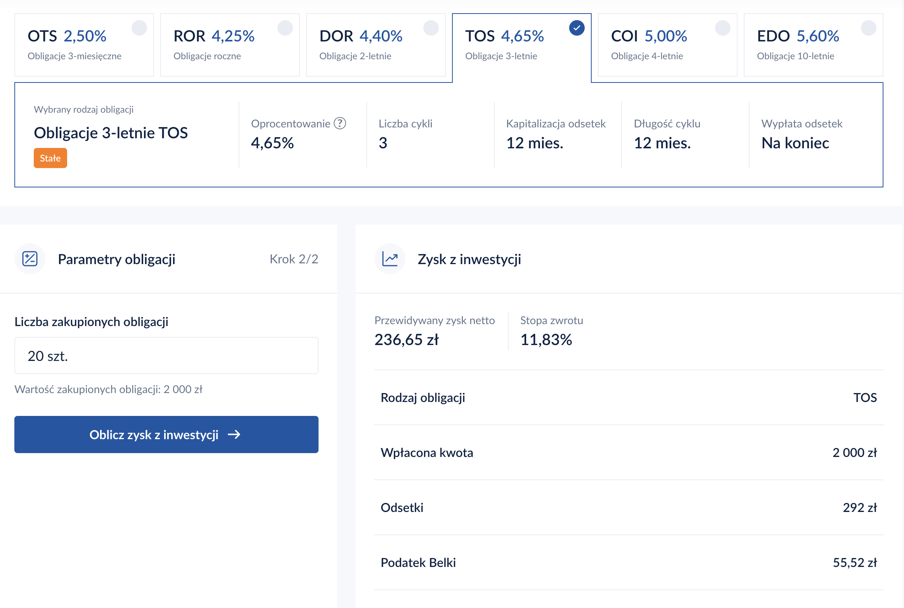
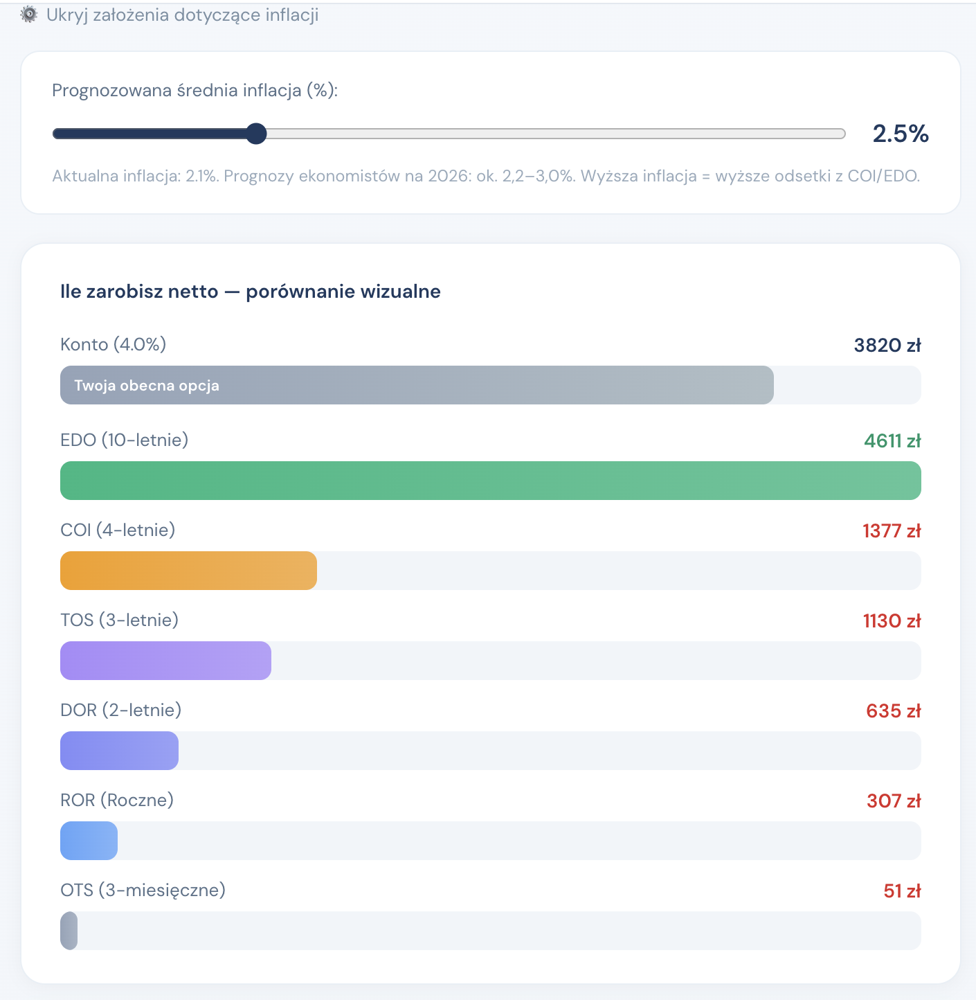
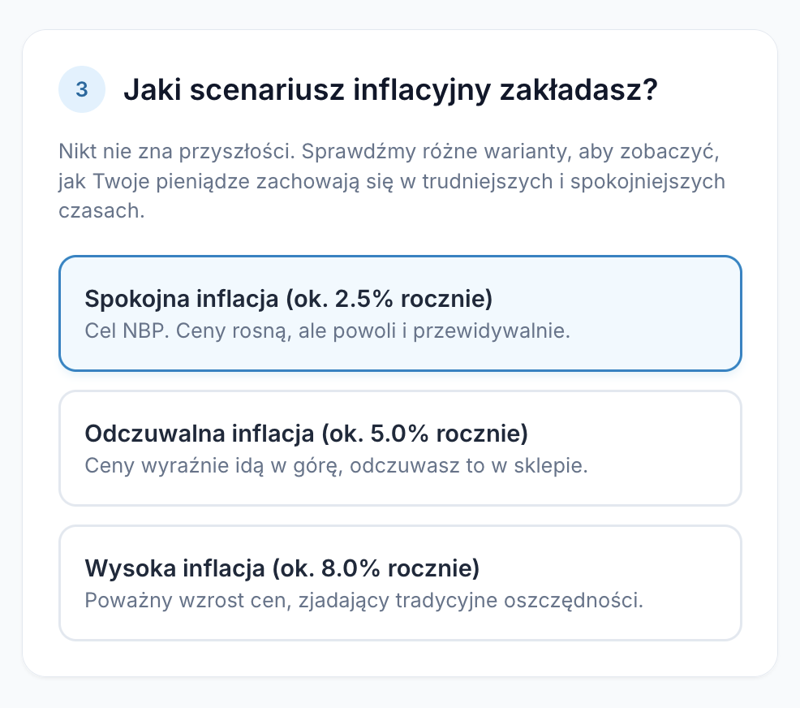
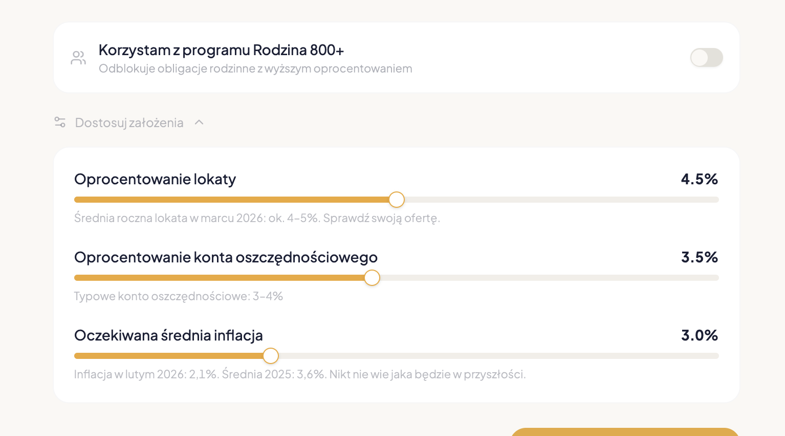
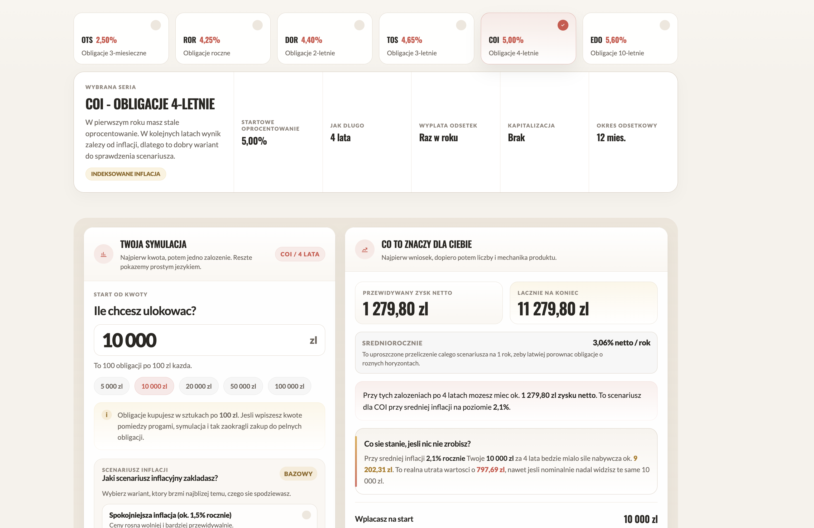
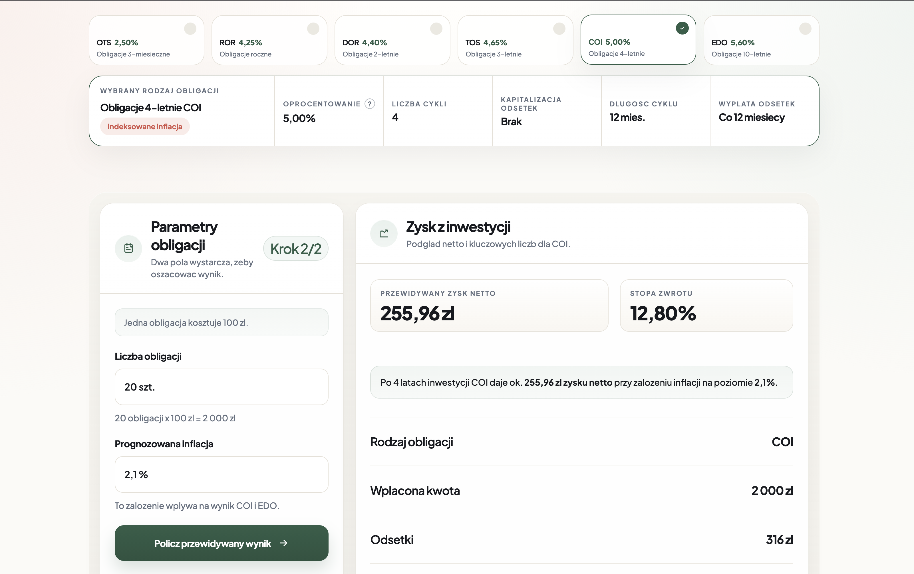

# Proces iteracji i screeny

To jest krótki zapis najważniejszych checkpointów w pracy nad kalkulatorem. Nie chodzi tu o pełną kronikę każdego ruchu, tylko o pokazanie, jak zmieniał się sposób myślenia o produkcie.

## 1. Wczesny kalkulator

Start był dość klasyczny: dużo parametrów, osobny przycisk oblicz i wynik pokazany bardziej jak narzędzie finansowe niż ekran dla początkującej osoby.

To był dobry punkt wyjścia do zrozumienia problemu, ale jeszcze nie odpowiedź na niego.

## 2. Compare-heavy direction

Kolejny etap poszedł mocniej w szerokie porównanie: wiele produktów na jednym ekranie, wizualne zestawienie wyników, więcej analityki.

To dało dobry obraz rynku, ale podnosiło próg wejścia. Narzędzie robiło się mądrzejsze, ale niekoniecznie prostsze.

## 3. Guided flow

Pojawiła się też próba lekkiego poprowadzenia użytkownika krok po kroku. Ten kierunek pomógł uprościć decyzje i zobaczyć, jak dużo daje praca na jednym pytaniu naraz.

Jednocześnie zaczął ujawniać koszt zbyt długiego flow. Gdy wynik pojawia się za późno, spada tempo i energia doświadczenia.

## 4. Portfolio-led shell

Na tym etapie zaczęło się dopracowywanie shellu i hierarchii. Wersja portfolio-led była spokojna, czytelna i bliska estetyce całego case study.

Dała dobry fundament layoutu, ale nie była jeszcze wystarczająco osadzona w języku i charakterze FBO.

## 5. FBO-led shell

Następny pivot przesunął interfejs wyraźniej w stronę FBO. Nadal ważna była prostota, ale pojawił się bardziej redakcyjny rytm, mocniejsze rozumienie tego, co ma być hero, a co tylko wspierać decyzję.

Tutaj zaczął się już klarować finalny produkt: mniej wykresu i tabeli jako centrum, więcej odpowiedzi i interpretacji.

## 6. Final answer-first prototype

Finalny kierunek nie jest "najbardziej rozbudowany". Jest najbardziej czytelny.

Najpierw wynik. Potem koszt bezruchu. Potem porównanie z lokatą i kontem. Potem szczegóły, jeśli użytkownik ich chce. I dopiero na końcu materiały i kolejny krok.

## Co z tego wynikło

- Najlepiej działał nie ekran z największą liczbą informacji, tylko ekran z najlepszą kolejnością informacji.
- Najmocniejszy pivot nie był wizualny. Był produktowy: od porównywania do aktywacji.
- Iteracje najwięcej dawały wtedy, gdy pracowaliśmy na artefakcie, patrzyliśmy, co naprawdę przeszkadza w odbiorze i upraszczaliśmy bez sentymentu.
